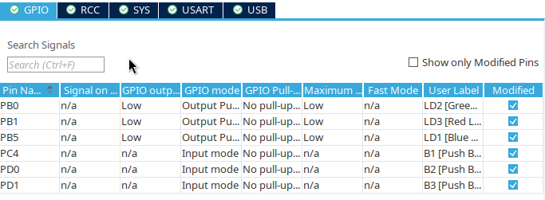

# Shortly about STM32WB55 GPIO ports

This section contains all important informations about GPIO that i learned so far

## GPIO port Address mapping

* GPIO A - *0x48000000*
* GPIO B - *0x48000400*
* GPIO C - *0x48000800*
* GPIO D - *0x48000C00*
* GPIO H - *0x48001C00*

## GPIO bit-banding

!!! info
    Unforutunately, bit-banding **is supported only for AHB1 and APBx** as stated in 
    [source](https://community.st.com/t5/stm32-mcus-products/bit-banding-ahb2-in-stm32l4-is-it-possible/td-p/483299).
    GPIO ports are part of AHB2 memory region (0x48000000) which doesn't fit
    in bit-banding memory alias for peripherals on address space is on 0x42000000. 
    I think this change is made because using bit-banding on GPIO usually doesn't give speed benefits 
    as stated in many books. Bit-banding is replaced with BSRR and BRR registers.

## GPIO accessing ports and registers

Each GPIO section has 11 registers, each register has size of 4 bytes and each bit of register 
corresponds to specific port (expect some registers, where 2 or 4 bits are used for single port)

| offset | register name | description |
|:------:|:-------------:|:-----------:|
| 0x0  | MODER   | Specifies mode of GPIO port. 2bit per port |
| 0x4  | OTYPER  | Specifies type of output (push-pull or open-drain) |
| 0x8  | OSPEEDR | Specifies output speed time that affects switch from low state to high state |
| 0x0B | PUPDR   | Specifies if pull-up or pull-down resistors should be used. 2bit per port |
| 0x10 | IDR     | Used for reading value from port (only for input ports) |
| 0x14 | ODR     | Used for setting output value - low(0), high(1) (only for output ports) |
| 0x18 | BSRR    | Used for atomic reset and set port (only for write). Very fast. First 16 bits are used for SET, last 16 bits are used for RESET, zero's are ignored |
| 0x1B | LCKK    | Used for mode locking. After locking port can't be reset until restart |
| 0x20 | AFRL    | Used for setting port "special" function, like UART (if MODER is equal to 0x10) 4bits per port are used |
| 0x24 | AFRH    | Same as AFRL but for next 8 ports (because all ports could not fit in AFRL)
| 0x28 | BRR     | Similar to BSRR but used only for port reset |

In code these registers can be accessed by adding offset to base GPIO_TYPE address or via GPIO_TypeDef pointer. Example for GPIO B and ODR register
```c
//via address and offset
uint32_t *ODR = (uint32_t*)(0x48000400 + 0x14);
*ODR |= 0x01 //set HIGH to first port

//via GPIO_TypeDef pointer
GPIO_TypeDef *gpioA = (GPIO_TypeDef*)(0x48000400);
gpioA->ODR |= 0x02 //set HIGH to second port
```

More about registers on page 300 in
[rm0434](https://www.st.com/resource/en/reference_manual/rm0434-multiprotocol-wireless-32bit-mcu-armbased-cortexm4-with-fpu-bluetooth-lowenergy-and-802154-radio-solution-stmicroelectronics.pdf)

## GPIO port purpose setting
GPIO port purpose can be set via CubeMX editor as shown below

{ align=center,  width="50%"} 
{ align=center,  width="40%"}

or in code with `GPIO_TypeDef*` and `#!c void HAL_GPIO_Init(GPIO_TypeDef *portSection, GPIO_InitTypeDef *initStruct)` (you can also set purpose via registers)

```c
GPIO_InitTypeDef initStruct;
initStruct.Pin = 1;
initStruct.Mode = GPIO_MODE_OUTPUT_PP;
initStruct.Pull = GPIO_NOPULL;
initStruct.Speed = GPIO_SPEED_FREQ_LOW;
initStruct.Alternate = 0;
HAL_GPIO_Init(GPIOC, &initStruct);
```
!!! info
    HAL_GPIO_Init function is called for each pin that set in CubeMX in MX_GPIO_Init function

GPIO_InitTypeDef structure contains:

* Pin - Number from 1 to max for specific GPIO region (ex. 1 to 15 for GPIO A, B, C)
* Mode - Determines GPIO purpose
    
| Mode Type      | Description | 
|:--------------:|:-----------:|
| GPIO_MODE_INPUT | In this mode port only can read values |
| GPIO_MODE_ANALOG | Either output or input, controlled by ADC_ functions and structs |
| GPIO_MODE_OUTPUT_PP | In this mode port can only output low or high. Output values are controlled by two transistors N-MOS |
| GPIO_MODE_OUTPUT_OD | In this mode port can only output low (N-MOS) or float. Floating means that port is not connected to anything, it's neither 1 or 0. To make floating state useful you must fill field *Pull* with GPIO_PULL_UP or GPIO_PULL_DOWN or provide output with external pull-up/pull-down resistors. [Explanation from TechVedas. learn](https://youtu.be/IjKDKGqCm_4) |
| GPIO_MODE_AF_PP | In this mode port purpose is determined by *Alternate* field. Controlled by two transistors. Used by unidirectional protocols (UART) |
| GPIO_MODE_AF_OD | In this mode port purpose is determined by *Alternate* field. Has low and floating state. Used by multidirectional protocols (i2c) |
| GPIO_MODE_IT_RISING | Performs IRQ when value of input port changes to 1 |
| GPIO_MODE_IT_FALLING | Performs IRQ when value of input port changes to 0 |
| GPIO_MODE_IT_RISING_FALLING | Performs IRQ when value of input port changes |
| GPIO_MODE_EVT_* | Related to sleep mode |

* Pull - Determines if internal pull resistor is used. Can have GPIO_PULLUP (VCC), GPIO_PULLDOWN (Ground) or GPIO_NOPULL
* Speed - Determines speed of change from low to high for port configured with OUTPUT mode 
* Alternate - Determines "special" function for port (like USART or i2c). Possible values depends on port. Values starts with word *GPIO_AF*

Purpose of port can be locked (become unchangable until reset) via `!#c void HAL_GPIO_LockPin(GPIO_TypeDef *portSection, uint16_t pinNum)`

## HAL GPIO functions

For reading value from port is used function `#!c void GPIO_PinState HAL_GPIO_ReadPin(GPIO_TypeDef *portSection, uint16_t pinNum)` 
which returns GPIO_PIN_RESET (0) or GPIO_PIN_SET (1)

For writing value to port is used function `#!c void HAL_GPIO_WritePin(GPIO_TypeDef *portSection, uint16_t pinNum, GPIO_PinState value)`

For switching value in port (off when on and on when off) is used function `#!c void HAL_GPIO_TogglePin(GPIO_TypeDef *portSection, uint16_t pinNum)`


example:
```c
HAL_Delay(100); //sleep for 100ms
//Checks if button 3 is pressed
//(by default pin is floating so you should set pull-up resistor)
if (HAL_GPIO_ReadPin(GPIOD, GPIO_PIN_1) == GPIO_PIN_RESET) //GPIO_PIN_RESET because when button is unpressed, value of port is GPIO_PIN_SET
    HAL_GPIO_WritePin(GPIOB, GPIO_PIN_0, GPIO_PIN_SET) //turn on green led
else
    HAL_GPIO_WritePin(GPIOB, GPIO_PIN_0, GPIO_PIN_RESET) //disable green led

HAL_GPIO_TogglePin(GPIOB, GPIO_PIN_5); //switch state of blue led
```

!!! note
    To ensure that GPIO ports will function you must enable clock to corresponding GPIO section via  
    `__HAL_RCC_GPIOx_CLK_ENABLE()` where x is replaced by GPIO section (ex. A, B). However CubeMX
    enables clocks for all GPIO sections used in .ioc in function MX_GPIO_Init. You can disable clocks
    via `__HAL_RCC_GPIOx_CLK_DISABLE()`, then GPIO ports will not respond to commands.