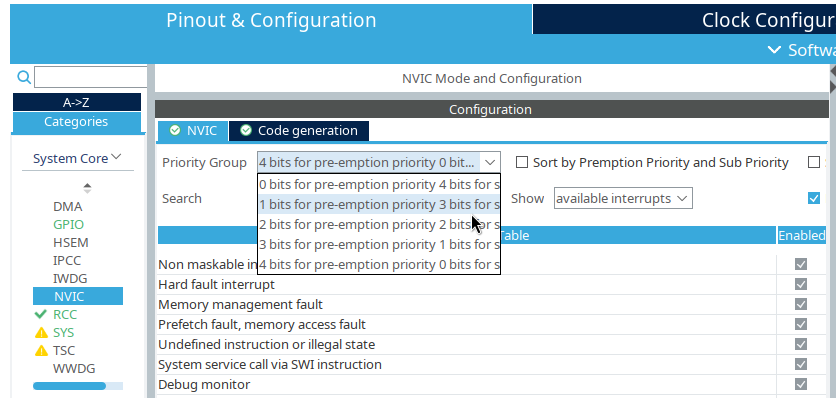

# STM32WB55 Interrupts

What is interrupt? **Interrupt** is event caused by hardware or CPU core. Interrupts create by CPU 
core are called **exceptions** or software interrupts. Term "interrupt" is interconnected with 
**Interrupt Request (IRQ)** which is a signal to request (create) interrupt. Interrupts are managed
by Nested Vector Interrupt Controller (NVIC) controller which is chip inside Cortex-M Core. 
Interrupts are handled by **Interrupt handler (ISR)** which are functions defined in high level 
language. Hardware interrupts can be caused by internal peripherals (timers) or by GPIO 
(keyboard switch).

Each interrupt has priority represented as a number in 8bit IPR register that can be set in code. The
lower is number, the highier is priority. Only left most significant bits of IPR register are used,
e.g Cortex M4 use 4 left most bits, Cortex M0 only 2. If incomming interrupt has highier priority 
than currently processing one then interrupt processing  will be stopped, it's state will be stored, 
interrupt with highier priority will be processed and  after processing of new interrupt previous 
interrupt will be resumed. That means that they can be stacked multiple interrupts with different
level of priority and so that's why NVIC is "Nested" 

Each internal interrupt is defined in vector table generated by ST in assembly file and looks like this:

| Address | Name | Description |
|:-------:|:----:|:-----------:|
| 0x0  | - | Entry point for all interrupts (points to end of SRAM ) |
| 0x4  | Reset | Entry point of application |
| 0x8  | NMI | Caused by High speed internal clock (HSI) or High speed external clock (HSE)
| 0xC  | HardFault | Interrupt for generic errors |
| 0x10 | BusFault | Memory access errors |
| 0x14 | UsageFault | Illegal instruction |
| 0x1C - 0x28 | - | Reserved |
| 0x2C | SVCall | Caused by Supervisor instruction/privileged instructions call. Privileged instruction is direct access to hardware whereare computation instructions are not privileged. More about this on [GeekForGeeks page](https://www.geeksforgeeks.org/privileged-and-non-privileged-instructions-in-operating-system/)
| 0x30 | Debug monitor | Used for debugging functionality (ex. breakpoints)
| 0x34 | - | Reserved
| 0x38 | PendSV | Similar to SVCall, but can be delayed |
| 0x3C | SysTick | Used for switching between tasks (called every x ms depending on config) |

full table is on page 367 in 
[rm0434](https://www.st.com/resource/en/reference_manual/rm0434-multiprotocol-wireless-32bit-mcu-armbased-cortexm4-with-fpu-bluetooth-lowenergy-and-802154-radio-solution-stmicroelectronics.pdf)

ISR names in assembly file can be changed because they are just symbols that will be used to look up
some function with this name exists in code.

[rm0434](https://www.st.com/resource/en/reference_manual/rm0434-multiprotocol-wireless-32bit-mcu-armbased-cortexm4-with-fpu-bluetooth-lowenergy-and-802154-radio-solution-stmicroelectronics.pdf)

## Enable/Disable specific interrupts
By default interrupts are disable except Reset, NMI and HardFault. Other Interrupts can be enabled 
via `#!c void HAL_NVIC_EnableIRQ(IRQn_Type irqN)` where irqN is enum value of interrupt we want to 
enable (ex. USART1_IRQn)

To disable interrupt use function `#!c void HAL_NVIC_DisableIRQ(IRQn_Type irqN)` where irqN is enum
value of interrupt we want to enable (ex. USART1_IRQn)

## EXTI

Interrupt sources are connected to EXTI controller which de facto works as multiplexer, e.g multiple
GPIO ports share same ISR. EXTI controller signals are sent to NVIC. EXTI controller is also used
for wakeup from sleep communicating with Wakeup Interrupt Controller (WIC).

EXTI have some caveats such as:

* It's not possible to use GPIO port that share same number for interrupts. If PA0 is used for interrupt, 
then you can't use PB0
* Some ports lanes share same EXTI lane (GPIO 10-15), so you have to use `#!c __HAL_GPIO_EXTI_GET_IT(pin)`
to check if interrupt sent from pin we want via comparing result with macros RESET (0) or SET(0). As
i understand, this process is called discrimination

Interrupts associacted with EXTI are named EXTIx_IRQn or EXTIx_y_IRQn, where x is a port number 
associated with EXTI or x and y determine range.

Usage of EXTI interrupt is shown below:
```c
int main()
{
    //your init code ...

    //you can also create initialization for button 3 from CubeMX
    GPIO_InitTypeDef initBtn3;
    initBtn3.Mode = GPIO_MODE_IT_RISING; //React when volatge becomes 1
    initBtn3.Pull = GPIO_PULLUP; //By default btn3 is floating when pressed
    initBtn3.Speed = GPIO_SPEED_FREQ_LOW;
    initBtn3.Alternate = 0;
    initBtn3.Pin = GPIO_PIN_1;
    HAL_GPIO_Init(GPIOD, &initBtn3);

    //Enable IRQ otherwise no signal will be send
    HAL_NVIC_EnableIRQ(EXTI1_IRQn); //enable EXTI1 because pin number is also 1 (D1)
}

//You must define ISR otherwise default weak function will be used
//Name of function corresponds to name in assemble file
void EXTI1_IRQHandler(void)
{
    // you must clear EXTI line otherwise this function will be endlessly called
    __HAL_GPIO_EXTI_CLEAR_IT(GPIO_PIN_1);
    HAL_GPIO_TogglePin(GPIOB, GPIO_PIN_0);
}

```

You can also use more abstract version where you have to define callback for all EXTI handlers.
Abstract version also performs interrupt discrimination for shared EXTI lines

```c
void EXTI1_IRQHandler(void)
{
    HAL_GPIO_EXTI_IRQHandler(GPIO_PIN_1);
}

void HAL_GPIO_EXTI_Callback(uint16_t pin)
{
    if (pin == GPIO_PIN_1)
        HAL_GPIO_TogglePin(GPIOB, GPIO_PIN_0);
}
```

## NVIC firing interrupt

You can create interrupt by software using function `#!c HAL_NVIC_SetPendingIRQ(IRQnType irqN)` 
however some function like `#!c void HAL_GPIO_EXTI_IRQHandler(uint32_t pin)` will not work because they 
expect that is EXTI pending bit (that is cleared by `__HAL_GPIO_EXTI_CLEAR_IT(EXTI_LANE)`). To 
remove interrupt from pending list use function `#!c void HAL_NVIC_ClearPendingIRQ(IRQn_Type irqN)`

To check if interrupt is waiting for his turn you can use function `#!c uint32_t HAL_NVIC_GetPendingIRQ(IRQn_Type irqN)`
which returns 1 (yes) or 0 (no). Related function `#!c uint32_t HAL_NVIC_GetActive(IRQn_Type IRQn)`
is used to check if interrupt is currently being processed.

## NVIC priority 

Interrupts in cortex M4 can also have sub priority, that mean that interrupt is with same preemptive
priority but highier sub priority can be serviced. Preemtive means that it can stop processing current
interrupt and shift to other. If sub priority highier but preemptive priority is same as processing 
interrupt then interrupt wit highier sub priority will be processed after current interrupt. However 
if two interrupts with same preemptive priority and different sub priority are in queue, interrupt 
with highier sub priority will be processed first after going out of queue. 

For sub priority can be used up to 4 most left bits 
of IPR depending on how priority division is configured. By default user can have 16 levels of
preemptive priority but 0 levels of sub priority. To change priority levels we can use function
```c
void HAL_NVIC_SetPriorityGrouping(uint32_t priorityGroup)
```
where as priorityGroup are used macros NVIC_PRIORITYGROUP_x, where x can be from 0 to 4 meaning how
much bit's are used for preemptive priorty level. NVIC_PRIORITYGROUP_4 equals to 16 leves of 
preemptive priority and 0 levels of sub priority. You can also set Priority group from CubeMX

{ align=center,  width="50%"}
  
Priority of interrupt can be set by using function 
```c
void HAL_NVIC_SetPriority(IRQn_Type irqN, uint32_t preemptivePriority, uint32_t subPriority)
```

To get priority you can use function 
```c
void HAL_NVIC_GetPriority(IRQn_Type irqN, uint32_t priorityGroup, uint32_t *preemptivePriority, uint32_t *subPriority)
```
where preemptivePriority and subPriority values from IPR register are set accroding to priorityGroup
parameter which is a bit weird but it works. To get currently used priorityGroup use function 
`#!c uint32_t HAL_NVIC_GetPriorityGrouping()`


## NVIC Priority Masking
By setting a mask, we can disable interrupts (via PRIMASK reg). and exception (via FAULTMASK reg.)
or renable them by clearing a mask. There are two helper macros `#!c __disable_irq()` and 
`#!c __enable_irq()`, their usage you can derive from their name. There are also getters(__get_)
and setters(__set_) macros for PRIMASK and FAULTMASK. Cortex M4 supports masking interrupts for
specific priority using BASEPRI register or using macro `#!c __set_BASEPRI(level)` where level
represents what interrupt priorities will be blocked from level to 0xFF
