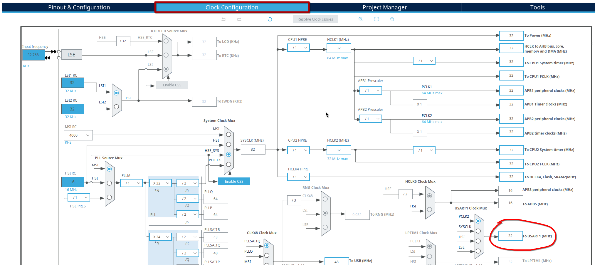
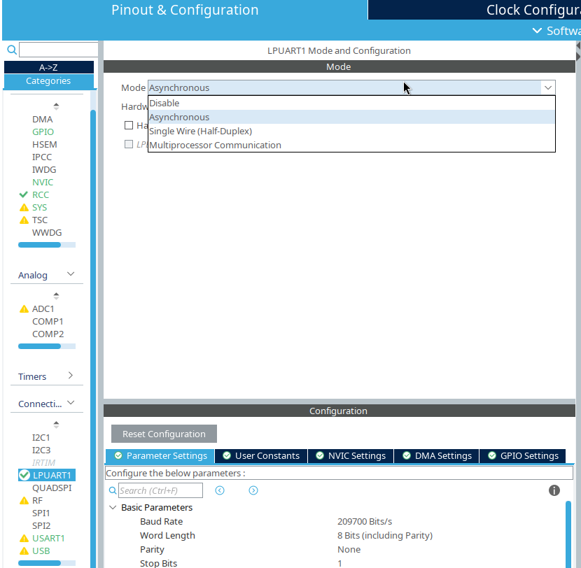
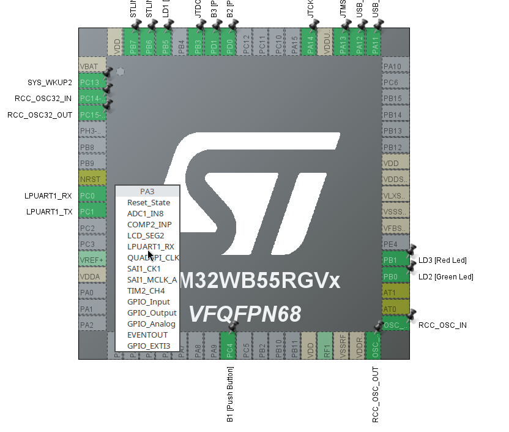

# USART/UART

**USART/UART** defines <u>set of rules (not specificaly protocol)</u> for serial communication between 
two and only two parties. Communication can be unidirectional or bidirectional. USART is universal 
sync/async reciever transmitter where as UART is a universal async reciever transmitter but generaly 
when we say *USART* we think about synchronous communication.

Synchronous communication uses 
**rx(recieve channel)** or/and **tx(transmission channel)**and **shared clock** between two parties 
(clock line) to synchronize communication where as async don't use clock. Instead, in UART two parties 
must set same **baud rate (changes of signal per second)** and each byte must containt start bit and 
stop bit. <u>Baud rate is not specificaly 1 bit per second</u>, because each baud can contain more 
than 1 bit depending on protocols. We can't use any baud rate because of internal clock synchronization
so only commonly used baud rates must be used (9600, 14400, 19200, 38400, 57600, 115200)

To separate noise from real data in UART is oversampling used. During recieval one baud is split 
to 8 or 16 samples. From 8/16 samples are important only 3 middle samples. If value of all 3 samples
not equal to 0 or 1 then it's a noise. If one bit sampling is enabled, then only 1 sample from 8/16
sample is used and no detection is performed
[fastbitlab has great article about oversampling](https://fastbitlab.com/usart-oversampling/)

Some protocols (RS232) that implement UART use more than two lines (rx, tx). The reason is that they
establish some sort of handshake. In IEEE 802.11 RTS/CTS, sender (tx) uses **RTS** line to recieve 
permission to send and **CTS** line is used by reciever to inform sender that it can send. 

## UART clock speed

As i mentioned previously, UART doesn't use shared clock line but instead uses clock for self to 
sync to baud rate. Each x ticks of clock is one baud is being read or written.

To calculate how much ticks it's required until one baud is reached we can use this formula:

$$
    CT = (16 / OS) * (CSp / BD)
$$

Where:

* CT ... Clock ticks
* OS ... Oversampling (could be 8 or 16)
* CSp ... Clock speed
* BD ... Baud rate

Clock speed of UART (USART) can be shown in CubeMX



## UART HAL

Before working with UART we have to initialize UART peripheral. For initailization is used 
struct *UART_HandleTypeDef*. First we have to fill field *Instance* that determines what UART 
peripheral we want to use because we can have multiple UART and each UART have it's own memory 
section. STM32 HAL have predefined macros for UART locations. Next we have to fill field *Init* 
where initialization data are stored such as baud rate and UART mode. Lastly we can fill 
fields that stores pointers to our rx/tx buffers and their sizes.

In code it will look something like this (CubeMX will generate similar code):

```c
    UART_HandleTypeDef huart;
    huart.Instance = LPUART1; //USART1 is also available
    huart.Init.Mode = UART_MODE_TX_RX; //can be also only TX or RX
    huart.Init.BaudRate = 9600; //speed
    huart.Init.Parity = UART_PARITY_NONE; //NO parity bit, can be also ODD or EVEN parity bit
    huart.Init.WordLength = UART_WORDLENGTH_8B; //each frame has 8 bits (not including start/stop bits), can be 7 or 9
    huart.Init.OverSampling = UART_OVERSAMPLING_16; //16 or can be 8 samples
    huart.Init.ClockPrescaler = UART_PRESCALER_DIV1; //clock speed is divided by this number (DIV1 = 0)
    huart.Init.OneBitSampling = UART_ONEBIT_SAMPLING_DISABLED; //if enabled, then noise detection is disabled and middle bit determines final result
    huart.Init.StopBits = UART_STOPBITS_1; //length of bit is 1 bit, can be 2 or 1.5
    huart.Init.HwFlowCtl = UART_HWCONTROL_NONE; //no handshake, but could be RTS, CTS or both. Not available on LPUART anyway
    HAL_UART_Init(&huart);
```

After initialization we have initialize GPIO port for corresponding UART perh. RX/TX/HWControl.

```c

    GPIO_InitTypeDef initStruct;
    initStruct.Mode = GPIO_MODE_AF_PP; //altenative function mode suitable for UART
    initStruct.Speed = GPIO_SPEED_LOW;
    initStruct.Pull = GPIO_NOPULL;
    initStruct.Pin = GPIO_PIN_2 | GPIO_PIN_3; //(PA2 - TX, PA3 - RX)
    initStruct.Alternate = GPIO_AF8_LPUART1; //USART1 = GPIO_AF7_USART1
    HAL_GPIO_Init(GPIOA, &initStruct);

```

or via cubemx 

{ align=center,  width="40%"}
{ align=center,  width="50%"}

!!! note
    USART1 PB7 (RX) and PB6 (TX) is hardwired to VCP - virtual com port that acts like serial port 
    but is USB/other media. Only PB7 a PB6 can be used in serial monitor because they are mapped in
    VCP driver (/dev/ttyACM0) however it's safe to remap this ports to PA9 (TX) and PA10 (RX). Btw
    by default stm32 sends 7bit per frame ;)
